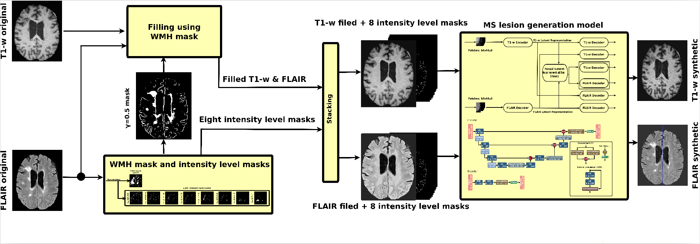

# Multiple Sclerosis Lesion Synthesis in MRI Using an Encoder-Decoder U-NET



A deep fully convolutional neural network model for MS lesion synthesis. The model takes as inputs T1-w and FLAIR images without MS lesions and outputs synthetic T1-w and FLAIR images with MS lesions. The MS lesion information is encoded as different binary masks passed to the model stacked with the input images. 


# About:

Magnetic resonance imaging (MRI) synthesis has attracted attention due to its various applications in the medical imaging domain. In this paper, we propose generating synthetic multiple sclerosis (MS) lesions on MRI images with the final aim to improve the performance of supervised machine learning algorithms, therefore, avoiding the problem of the lack of available ground truth. We propose a two-input two-output fully convolutional neural network model for MS lesion synthesis in MRI images. The lesion information is encoded as discrete binary intensity level masks passed to the model and stacked with the input images. The model is trained end-to-end without the need for manually annotating the lesions in the training set. We then perform the generation of synthetic lesions on healthy images via registration of patient images, which are subsequently used for data augmentation to increase the performance for supervised MS lesion detection algorithms. Our pipeline is evaluated on MS patient data from an in-house clinical dataset and the public ISBI2015 challenge dataset. The evaluation is based on measuring the similarities between the real and the synthetic images as well as in terms of lesion detection performance by segmenting both the original and synthetic images individually using a state-of-the-art segmentation framework. We also demonstrate the usage of synthetic MS lesions generated on healthy images as data augmentation. We analyze a scenario of limited training data (one-image training) to demonstrate the effect of the data augmentation on both datasets. Our results significantly show the effectiveness of the usage of synthetic MS lesion images. For the ISBI2015 challenge, our one-image model trained using only a single image plus the synthetic data augmentation strategy showed a performance similar to that of other CNN methods that were fully trained using the entire training set, yielding a comparable human expert rater performance.
(see original [publication](https://ieeexplore.ieee.org/document/8645628) for more information.)


# Requirements:

  The current version is based on [Keras](https://keras.io), so the
  following softwares are necessary to run the program:

* A decent machine running GNU/Linux. Deep learning methods are computationally expensive, so at least 8GB of RAM is necessary to train. Although this limitation can be addressed using data generators. 

* A running [Python](https://www.python.org) environment. We highly recommend using the [Virtualenv](https://virtualenv.pypa.io/en/latest/).

* [Git](https://git-scm.com/downloads).

* [Tensorflow](https://www.tensorflow.org/ "Tensorflow").

* [CUDA](https://developer.nvidia.com/cuda-zone). If you plan to use the MSLesionsGenerator using a GPU, please be sure that your computer has the appropriate [CUDA libraries](https://developer.nvidia.com/cuda-zone) installed.

	* On GNU/Linux, [this guide](http://docs.nvidia.com/cuda/cuda-installation-guide-linux/#axzz4WNL7OgLr) is an excellent resource to install CUDA on a different range of distributions.


# Installation:

Once these requirements are met, the rest of python libraries may be easily installed using ```pip```:

```bash
git clone https://github.com/NIC-VICOROB/MS_Lesions_Generator.git
cd MS_Lesions_Generator
pip install -r requirements.txt
```

# License:

This software is released under the version 3 of the GNU General Public License. Please read the license terms before using the software. A copy of this license is present in the root directory.

# Cite:

If you use this software, please cite it as:

```

@ARTICLE{SALEM2019, 
author={M. {Salem} and S. {Valverde} and M. {Cabezas} and D. {Pareto} and A. {Oliver} and J. {Salvi} and À. {Rovira} and X. {Lladó}}, 
journal={IEEE Access}, 
title={Multiple Sclerosis Lesion Synthesis in MRI Using an Encoder-Decoder U-NET}, 
year={2019}, 
volume={7}, 
number={}, 
pages={25171-25184}, 
keywords={Lesions;Magnetic resonance imaging;Training;Image segmentation;Generators;Pipelines;Multiple sclerosis;Brain;MRI;multiple sclerosis;synthetic lesion generation;convolutional neural network;data augmentation;deep learning}, 
doi={10.1109/ACCESS.2019.2900198}, 
ISSN={2169-3536}, 
month={},}

```
